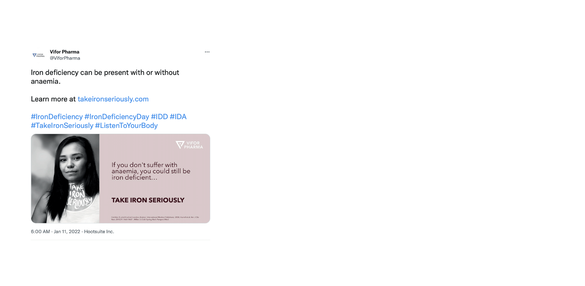

# POSTme!
### Tool for Social Media Messaging Optimization

POSTme!: Tool for Social Media Messaging Optimization
Social media environments have become remarkable platforms for companies, as they lead the way to enthusiastically communicate with users from all over the world. Hence, social media engagement has become a vital part of business success and a key part of marketing strategy. Having this in mind, Vifor Pharma, an 11-billion-dollar company based in Switzerland and a world leader in the discovery, development, manufacturing and marketing of pharmaceutical products, approached us with a specific task: to build a model which optimizes the engagement rate for Twitter and LinkedIn posts. We had to overcome two main challenges and these revolved around the question: How can a company improve its engagement rate? One of the tricky issues was the huge amount of information produced in social media environments. Also, another fact we encountered was the working logic of social media algorithms promoting paid posts. 
POSTme! is the ultimate solution to company’s social media strategy, it is a platform the brand team can input a potential social media post in and get an assessment out of the estimated engagement rate and feedback of what to improve etc.

Figure 1: A demonstration of how the model works and what features it uses to predict whether a specific post gets high or low engagement.

The project started with data preparation. Our data set consists of the company’s posts on LinkedIn and Twitter and the target variable we are trying to predict for each post has 2 labels: low and high engagement. The next step is feature engineering, where we tried to extract appropriate features for our classification. Thus, we applied syntactic parsing, entity extraction techniques, topic modeling and sentiment analysis with pre-trained transformers and word embeddings. After trying different combinations of features and models - machine learning models and deep learning architectures - we selected the winners:
features: count-based features + date based features + Natural Language Processing Features
model: Random Forest Classifier (the best in terms of accuracy and explainability)
In the end, we evaluated the features importance and performed SHAP and LIME analysis.
The short figure below shows a snapshot of the POSTme! platform and how it works. 

Figure 2: Snapshot of how the POSTme! platform works

Check out the [presentation](https://github.com/marcelaulloa/POSTme/blob/main/reports/README.md)!

## POSTme TEAM

**Amalia Temneanu**

Data Scientist with over 9 years experience in data modeling, corporate finance, business advisory and financial markets. Eager to contribute towards advancing companies' products, services and strategic decisions via the comprehensive quant skills I’ve developed thus far coupled with my deep and broad business acumen. Extensive international experience via projects in Central and Eastern Europe and the UK combined with a strategic mindset, strong organization and presentation abilities.

- Connect [linkedin](https://www.linkedin.com/in/amalia-temneanu-02090926/)
- Projects [github](https://github.com/AmaliaTemneanu)

**Marcela Ulloa**

Data Scientist and FP&A Certified professional, well versed on processes such as budgeting, reporting, and analysis.  8+ years of experience with Fortune 500 companies in the US and Latin America. Passionate about applying machine learning skills to help companies transition into more digital and data-driven financial decision-making.

- Connect [linkedin](https://www.linkedin.com/in/marcelaulloa/)
- Projects [github](https://github.com/marcelaulloa)

**Sibel Yasemin Özgan**

Data scientist with almost 10 years experience in academic research. My postgraduate training is in computational design, which affects my logic and approach to data science projects, where I adopt the design-thinking method. I possess the data scientist as well as designer toolkit to integrate the needs of people, the possibilities of technology, and the requirements for business success. I am a creative data story teller and a continuous learner.

- Connect [linkedin](https://www.linkedin.com/in/sibelyozgan/)
- Projects [github](https://github.com/sibelyozgan)
